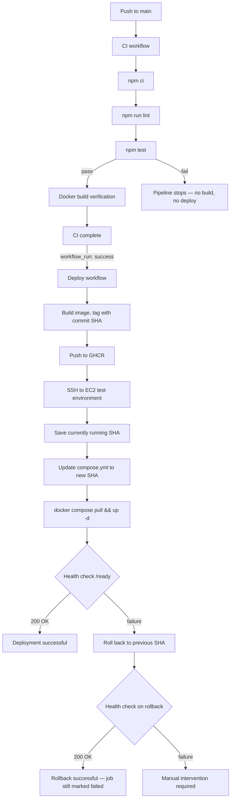
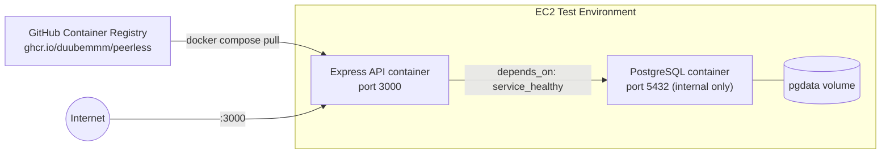

# Peerless — Safe Delivery Pipeline

A small Node.js/Express + PostgreSQL API, containerised with Docker, deployed to a test
environment on EC2 through a GitHub Actions pipeline with immutable image releases and
automatic rollback on failed health checks.

This submission addresses **Case Study 2 — Safe Delivery Pipeline**.

---

## 1. Overview

The goal of this pipeline is not the application itself — it is a deliberately small
API used to give the delivery pipeline something real to build, test, deploy, and roll
back. The engineering effort is concentrated on:

- Deterministic builds and tests
- A quality gate that fails clearly and blocks deployment when broken
- Immutable, SHA-tagged releases (never `latest` in a real deployment)
- Environment-specific configuration kept out of source control
- Automatic rollback when a deployed release fails its health check
- Concurrency control so two releases can't race against the same environment

## 2. Architecture

### 2.1 Pipeline flow



### 2.2 Runtime architecture (test environment)



### 2.3 Why this shape

- **Two containers, one Compose file** — no orchestration platform, no managed
  database service. This matches the assessment's explicit preference for "a small
  reproducible setup over unnecessary services or cost."
- **`depends_on: condition: service_healthy`** — the API container will not start
  until PostgreSQL's own `pg_isready` healthcheck passes, not just until the
  container process launches. This is real dependency ordering, not a race.
- **Named volume (`pgdata`)** — database state survives `docker compose down`,
  intentionally does not survive `docker compose down -v` (documented cleanup path).

## 3. Technology choices

| Concern         | Choice                        | Why                                                                 |
|-----------------|--------------------------------|----------------------------------------------------------------------|
| Application     | Node.js + Express              | Fast to build, small dependency footprint                            |
| Database        | PostgreSQL 16 (alpine)         | Relational, well-supported healthcheck (`pg_isready`)                 |
| Testing         | Node's built-in `node:test` + Supertest | No extra test framework dependency (no Jest/Mocha)          |
| Containerisation| Docker (multi-stage) + Compose | Small runtime image, non-root execution, local dependency ordering   |
| CI              | GitHub Actions (`ci.yml`)      | Deterministic install, lint, test, build-verify gate                 |
| Registry        | GitHub Container Registry      | Free for this scale, integrates with `GITHUB_TOKEN` (no extra PAT for push) |
| Deployment      | GitHub Actions (`deploy.yml`) + SSH | No extra CD platform; explicit, auditable shell steps           |
| Test environment| Single EC2 instance             | Matches assessment's cost/scope guidance                             |

## 4. Prerequisites

- Docker and Docker Compose (v2, `docker compose` not `docker-compose`)
- Node.js 20+ (only needed for local development outside containers)
- An `.env` file (see [Configuration & Secrets](#10-configuration--secrets))

## 5. Local setup

```bash
git clone git@github.com:Duubemmm/peerless.git
cd peerless
cp .env.example .env
docker compose up --build
```

## 6. Running the application

```bash
curl http://localhost:3000/health
curl http://localhost:3000/ready
```

- `/health` — confirms the Express process is running.
- `/ready` — confirms the process **and** a live PostgreSQL connection (`SELECT 1`).

## 7. Running tests

```bash
npm ci
npm test
npm run lint
```

Tests use Node's built-in test runner and Supertest against the Express app directly
(no port binding, no live server required).

## 8. CI/CD pipeline — Outcome 1: Build and Verify

**`.github/workflows/ci.yml`** runs on every push and pull request to `main`:

1. `npm ci` — deterministic install from the lockfile (never `npm install` in CI)
2. `npm run lint` — ESLint flat config, recommended rules
3. `npm test` — full test suite via `node --test`
4. `docker build` — build verification only; this job does **not** push anywhere

The `build` job has `needs: test`, so a failing test structurally blocks the build
step from ever running — not just an ordering convention, an enforced dependency.

**This is the actual quality gate.** See [Evidence](#14-evidence) for a real captured
run where a broken test stopped the pipeline before any image was built.

## 9. Deployment — Outcome 2: Release Safety

**`.github/workflows/deploy.yml`** is a **separate** workflow from CI, triggered only
after CI completes successfully:

```yaml
on:
  workflow_run:
    workflows: ["CI"]
    types: [completed]
    branches: [main]
jobs:
  build-and-push:
    if: ${{ github.event.workflow_run.conclusion == 'success' }}
```

This means a failing CI run **cannot** reach deployment — deploy only fires on a
`workflow_run` event whose `conclusion` is `success`, and it checks out the exact
commit CI validated (`github.event.workflow_run.head_sha`), not just "whatever is
on `main` right now."

> **Note on how this was discovered:** the two workflows were originally both
> triggered independently on `push: main`. This meant a broken test in `ci.yml`
> did not stop `deploy.yml` from running, because they shared no state. This gap
> was found by deliberately breaking a test and watching `deploy.yml` deploy
> anyway. It was fixed by switching `deploy.yml`'s trigger to `workflow_run` gated
> on CI's `conclusion`. See [Limitations](#18-limitations) for the full story —
> this is intentionally left visible as a documented example of the discovery
> and fix process, not scrubbed from history.

### 9.1 Environment-specific configuration and protected secrets

- **Local development**: `.env` (gitignored) supplies Postgres credentials to
  Compose via variable interpolation.
- **CI**: no secrets needed — lint/test/build-verify never touch real credentials.
- **Deployment**: three secrets stored in **GitHub Actions Secrets**
  (Settings → Secrets and variables → Actions), never in source:
  - `DEPLOY_HOST` — EC2 public IP
  - `DEPLOY_USER` — SSH username
  - `DEPLOY_SSH_KEY` — private key content, used only inside the ephemeral
    Actions runner for the duration of the job
  - `GITHUB_TOKEN` — auto-issued per run by GitHub, scoped via
    `permissions: packages: write` to the minimum needed to push to GHCR
- **Runtime configuration on EC2**: a `.env` file lives only on the server at
  `/opt/peerless/.env`, never committed, supplied to containers by Compose at
  deploy time.

### 9.2 Promotion

There is a single promotion path: a pull request into `main`, gated by CI, then
automatically deployed. No manual "promote to test" step exists separately —
merging to `main` **is** the promotion event.

### 9.3 Versioning

Every image is tagged with the full Git commit SHA it was built from:

```
ghcr.io/duubemmm/peerless:<commit-sha>
```

A convenience `:latest` tag is also pushed, but **deployment always references
the SHA tag explicitly**, never `latest`. The server's `compose.yml` is rewritten
by the deploy script (`sed`) to point at the exact SHA being deployed, so at any
moment `docker compose ps` shows exactly which commit is live.

### 9.4 Rollback

Before deploying a new SHA, the deploy script reads the SHA **currently** running
on the server from `compose.yml` and writes it to `/opt/peerless/PREVIOUS_VERSION`.
After deploying the new image, it health-checks `/ready`:

- **Pass** → deployment recorded as successful (`CURRENT_VERSION` updated), job succeeds.
- **Fail** → the script rewrites `compose.yml` back to the previous SHA, redeploys
  it, and re-checks `/ready`. If that recovery succeeds, the server is left
  healthy — **but the GitHub Actions job still exits with failure**, because a
  rollback happening at all means the deployment attempt itself did not succeed.
  This is a deliberate choice: the pipeline should never report green when a
  rollback had to happen.
- **If rollback itself fails** → the job fails loudly with an explicit message
  that manual intervention is required. No infinite retry, no silent masking.

See [Evidence](#14-evidence) for a captured log of this actually happening against
a genuinely broken `/ready` route.

### 9.5 Concurrency control

```yaml
concurrency:
  group: test-deployment
  cancel-in-progress: false
```

Only one deployment to the test environment can run at a time. A second push
while a deploy is in progress **queues** rather than cancelling the first —
`cancel-in-progress: false` was chosen deliberately over cancellation, since
killing a deploy mid-flight against a live environment is riskier than a short
wait.

## 10. Configuration & Secrets

| Variable            | Where it lives                          | Committed? |
|----------------------|------------------------------------------|------------|
| `POSTGRES_USER`      | `.env` (local) / server `.env` (EC2)     | No — `.env.example` is committed as a template |
| `POSTGRES_PASSWORD`  | same as above                            | No |
| `POSTGRES_DB`        | same as above                            | No |
| `DEPLOY_HOST`        | GitHub Actions Secrets                   | No |
| `DEPLOY_USER`        | GitHub Actions Secrets                   | No |
| `DEPLOY_SSH_KEY`     | GitHub Actions Secrets                   | No |
| `GITHUB_TOKEN`       | Auto-issued per workflow run by GitHub   | N/A — never stored |

`.env` is listed in `.gitignore`. `.env.example` is committed with placeholder
values so another engineer knows exactly what to fill in.

## 11. Security considerations

- **Non-root container execution** — the Dockerfile creates and switches to
  `appuser` before the app runs; nothing runs as root inside the container.
- **Multi-stage build** — the runtime image contains only production
  dependencies (`npm ci --omit=dev`) and application code; no dev tooling, test
  files, or ESLint config ship in the final image.
- **Least-privilege registry token** — GHCR push uses the auto-issued
  `GITHUB_TOKEN`, scoped only to `packages: write` for that job, rather than a
  broad personal access token.
- **Private GHCR package** — pushed images are private by default under the
  repository owner's account.
- **SSH key scoped to deployment only** — a dedicated key pair was generated
  specifically for CI-driven deployment, separate from any personal
  instance-access key.
- **Port 3000 exposed publicly (0.0.0.0/0) on the test EC2 instance** — a
  deliberate trade-off, documented here: this allows a reviewer to verify the
  live deployment directly without needing VPN or SSH access. In a real
  production environment this would sit behind a load balancer / VPN and not be
  publicly reachable. PostgreSQL itself is **not** exposed — it is only
  reachable from the `api` container over the internal Compose network.

## 12. Cost considerations

- **Single EC2 instance**, not ECS/EKS/Fargate — this assessment needs one
  service and one test environment; a managed orchestrator would add cost and
  operational surface with no corresponding benefit at this scale.
- **PostgreSQL runs as a container on the same host** rather than a managed
  RDS instance, to avoid a second billable service. The trade-off is reduced
  high availability and no automated backups — acceptable for a test
  environment, not appropriate for production.
- **No Elastic IP attached** — the instance's public IP can change on
  stop/start. Documented as a known limitation rather than paying for a static
  IP that this assessment doesn't require.
- **Small Docker images** — Alpine base images and multi-stage builds keep
  image size and registry storage/transfer cost down.

## 13. Assumptions

- The reviewer has Docker and Docker Compose available locally to run the
  reproducible local setup.
- A single test environment is sufficient; no separate staging/production
  split was required by the case study.
- Synthetic, non-sensitive values (e.g. `example-password`) are acceptable for
  local/test database credentials, per the assessment's explicit allowance for
  synthetic data.

## 14. Evidence

All raw logs and screenshots are in [`docs/evidence/`](./docs/evidence/):

| Evidence                                   | File(s) |
|---------------------------------------------|---------|
| Successful pipeline run (CI → Deploy)       | `successful-deploy.log` |
| Intentionally failed quality gate (CI)      | `failed-gate.log` |
| Rollback triggered by a failed health check | `rollback-demo.log` |

The rollback log specifically shows the full sequence: new SHA deployed →
`/ready` returns a real failure → previous SHA automatically restored → `/ready`
confirmed healthy again → job still reported as failed, by design.

## 15. Troubleshooting

| Symptom | Likely cause | Fix |
|---------|--------------|-----|
| `docker compose up` fails on `db` healthcheck | Postgres still initialising | Wait — healthcheck has 5 retries at 5s intervals before failing |
| `/ready` returns 503/500 | Database unreachable or credentials mismatch | Check `.env` matches `compose.yml` env vars; check `docker compose logs db` |
| Deploy job can't SSH | Security group not allowing port 22 from GitHub-hosted runner IPs, or key mismatch | Confirm `DEPLOY_SSH_KEY` secret matches the key in the server's `authorized_keys` |
| Image pull fails on EC2 | GHCR auth expired or not configured on the server | Re-run `docker login ghcr.io` on the instance with a valid `read:packages` token |

## 16. Cleanup

```bash
# Local
docker compose down -v      # -v also removes the pgdata volume

# EC2 test environment
ssh -i <key>.pem ubuntu@<host>
cd /opt/peerless
docker compose down -v
```

## 17. Limitations

- **EC2 instance has no Elastic IP** — its public IP changes on stop/start;
  `DEPLOY_HOST` would need updating in GitHub Secrets after a restart.
- **CI and Deploy were originally two independently-triggered workflows**,
  meaning a failed CI run did not initially block deployment. This was found
  through deliberate testing (see Section 9) and fixed by gating `deploy.yml`
  on `workflow_run: conclusion == success`. Documented here rather than hidden,
  since finding and fixing this gap is itself part of the engineering story.
- **Rollback is single-level** — it restores the immediately previous SHA only,
  not an arbitrary point further back in history. A deeper rollback would
  require reading further back through deploy history/logs rather than a
  single state file.
- **No database migration/schema-rollback story** — since no schema currently
  exists beyond `SELECT 1`, this wasn't exercised. A real schema would need a
  documented approach to whether rollback also implies a schema rollback.

## 18. AI Use Disclosure

AI assistance (Claude) was used throughout this project for:
- Architectural discussion and trade-off review
- Debugging (DNS resolution in WSL2/Docker Engine, stale build cache issues,
  GHCR tag lowercasing, git/SSH key troubleshooting)
- Drafting and reviewing GitHub Actions workflow YAML
- Structuring this documentation

All infrastructure decisions, testing of the actual pipeline against a live
EC2 environment, and verification of each outcome were performed directly by
the author.