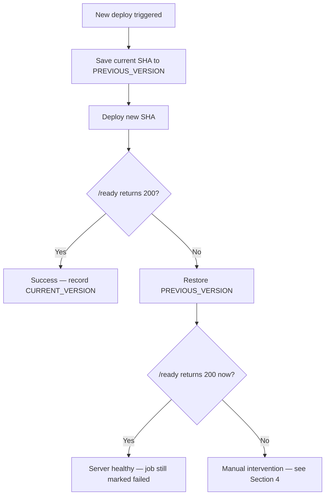

# Peerless — Test Environment Runbook

Operational reference for anyone supporting the Peerless test deployment.
For architecture and pipeline design rationale, see [README.md](./README.md).

**Owner:** Dubem (repo: `github.com/Duubemmm/peerless`)
**Environment:** Single EC2 instance, Docker Compose (`api` + `db`)
**Registry:** `ghcr.io/duubemmm/peerless`

---

## 1. Quick health check

```bash
curl http://<DEPLOY_HOST>:3000/health   # process alive?
curl http://<DEPLOY_HOST>:3000/ready    # process + database reachable?
```

| Response | Meaning |
|----------|---------|
| Both 200 | Everything healthy |
| `/health` 200, `/ready` 500/503 | App is up, database is not reachable |
| Neither responds | Container down, or port/security group blocking access |

## 2. Deployment failed (GitHub Actions `deploy` job shows red)

1. Open the failed run in the **Actions** tab → `deploy` job → read the log.
2. Identify the image SHA that was being deployed (printed as `NEW_SHA=...`
   near the top of the script output).
3. Check what the log says happened:
   - **"Health check failed. Rolling back..."** → the pipeline already
     attempted an automatic rollback. Skip to Section 3 to confirm it
     succeeded.
   - **"Rollback also failed. Manual intervention required."** → go straight
     to Section 4 (manual recovery).
   - **SSH/connection error before any deploy logic ran** → likely a
     credentials or network issue, not an application issue. Check:
     - `DEPLOY_HOST` secret matches the instance's current public IP
       (it changes on stop/start — no Elastic IP is attached)
     - Security group allows inbound port 22 from GitHub-hosted runners
     - `DEPLOY_SSH_KEY` secret matches a key present in the server's
       `~/.ssh/authorized_keys`
4. SSH into the instance directly and check current state:
   ```bash
   ssh -i <key>.pem ubuntu@<host>
   cd /opt/peerless
   docker compose ps
   docker compose logs api --tail=50
   docker compose logs db --tail=50
   ```
5. Confirm the database connection specifically:
   ```bash
   docker compose exec db pg_isready -U app -d peerless
   ```
6. Record the incident: which SHA failed, what the log showed, and the root
   cause once identified (see Section 5).

## 3. Confirming an automatic rollback succeeded

The deploy script rolls back automatically on a failed health check. To
confirm the server is actually in a good state after this:

```bash
ssh -i <key>.pem ubuntu@<host>
cd /opt/peerless
cat compose.yml | grep image        # should show the PREVIOUS good SHA
cat PREVIOUS_VERSION                 # the SHA it rolled back to
curl http://localhost:3000/ready     # should return 200
```

Even though the **GitHub Actions job shows failed** (by design — a rollback
occurring means the deployment attempt itself did not succeed), the **server**
should be healthy at this point. If `/ready` is genuinely healthy here, no
further action is needed beyond fixing the underlying bug in the next commit.

## 4. Manual rollback (automatic rollback did not run or also failed)

```bash
ssh -i <key>.pem ubuntu@<host>
cd /opt/peerless

# Find the last known-good SHA — either from PREVIOUS_VERSION,
# or from GitHub: Actions tab → filter to successful `deploy` runs → most
# recent one's SHA
cat PREVIOUS_VERSION

# Manually point compose.yml at that SHA
sed -i "s|image: ghcr.io/duubemmm/peerless:.*|image: ghcr.io/duubemmm/peerless:<good-sha>|" compose.yml

docker compose pull
docker compose up -d
sleep 5
curl -f http://localhost:3000/ready
```

If this also fails, treat it as a broader environment issue, not an
application issue — check Section 6 (Postgres-specific recovery) and Section 7
(full environment recovery) before assuming the image itself is at fault.

## 5. Root cause recording

For every incident, record (even briefly, in a commit message or issue):
- Which commit SHA failed and why (what did `/ready` or logs show)
- Whether automatic rollback fired and succeeded
- Time to detect, time to recover
- Any change needed to prevent recurrence (e.g. a missing test case)

## 6. Database-specific recovery

```bash
docker compose exec db pg_isready -U app -d peerless
docker compose logs db --tail=100
```

If PostgreSQL itself is unhealthy (not just unreachable from the API):
```bash
docker compose restart db
# wait for healthcheck
docker compose ps
```

If data corruption is suspected and this is genuinely disposable test data:
```bash
docker compose down
docker volume rm peerless_pgdata
docker compose up -d
```
**Warning:** this permanently deletes all data in the test database. Never run
this against anything containing data that matters.

## 7. Full environment recovery (last resort)

```bash
ssh -i <key>.pem ubuntu@<host>
cd /opt/peerless
docker compose down
docker compose pull
docker compose up -d
sleep 5
curl -f http://localhost:3000/ready
```

If this still fails, check:
- Disk space: `df -h`
- Docker daemon itself: `sudo systemctl status docker` or `sudo service docker status`
- GHCR authentication hasn't expired: `docker login ghcr.io -u duubemmm --password-stdin`

## 8. Escalation

This is a single-maintainer test project with no on-call rotation. If none of
the above resolves the issue:
1. Capture `docker compose logs` for both services in full.
2. Capture the failing GitHub Actions run URL.
3. Open an issue in the repository with both, tagged with the incident date.

## 9. Rollback procedure summary (for reference)

